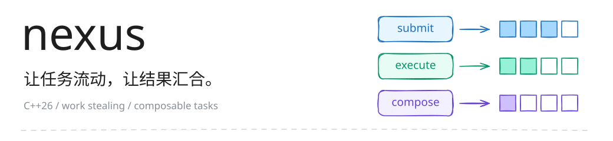
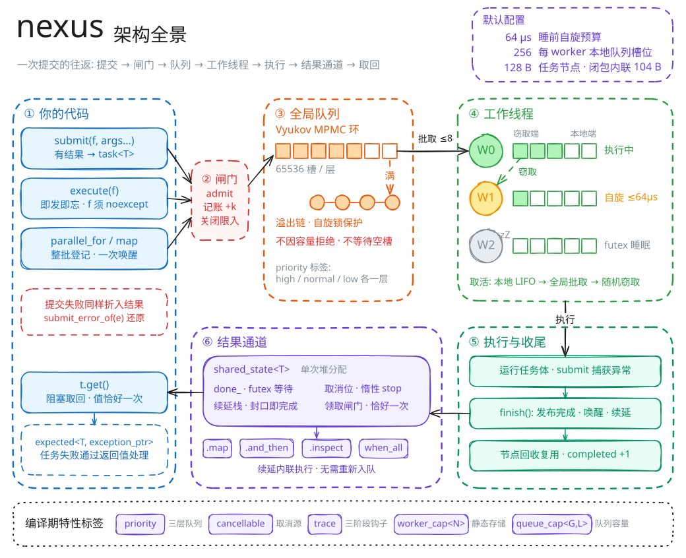

<p align="center">
  
</p>

<p align="center">
  <a href="https://en.cppreference.com/w/cpp/26"></a>
  
  
  <a href="LICENSE"></a>
  <a href="https://app.codspeed.io/huxint/nexus"></a>
</p>

<p align="center">
  <a href="#使用示例">使用示例</a> ·
  <a href="#性能">性能</a> ·
  <a href="#架构">架构</a> ·
  <a href="docs/api.md">接口文档</a> ·
  <a href="docs/build.md">配置与运行</a>
</p>

**nexus** 是面向低延迟、高吞吐并发计算的 C++26 任务调度库。
仅需头文件，核心零依赖；支持任务提交、结果组合与区间并行处理。

## 使用示例

```cpp
#include <nexus/nexus.hpp>
#include <print>

int main() {
    using namespace huxint::nexus;
    pool p;

    auto sum = when_all(
        p.submit([] { return 100; }),
        p.submit([] { return 200; })
    ).map([](int a, int b) { return a + b; });

    if (auto result = sum.get()) {
        std::println("sum = {}", *result); // sum = 300
    } else {
        return 1;
    }
}
```

[构建与接入](docs/build.md#构建与接入) · [更多接口](docs/api.md)

## 性能

Intel i7-12650H、GCC 16.2.1、Release、8 个工作线程，2026-09-30 实测。
吞吐取三次运行最佳值；延迟为采样分位数。

| 场景 | Taskflow | BS::thread_pool | nexus |
| :--- | ---: | ---: | ---: |
| 单生产者即发即忘 · 百万任务/s | 1.24 | 0.40 | **8.39** |
| 逐个提交并取回 · 百万任务/s | 0.38 | 0.27 | **2.09** |
| 递归 fork-join · 百万叶任务/s | 8.62 | 1.23 | **28.40** |
| 多生产者 ×8 · 百万任务/s | 2.76 | 1.36 | **7.60** |
| 往返延迟 P50 / P99 · µs | 2.66 / 7.44 | 3.75 / 6.01 | **0.44 / 0.87** |

性能随负载与机器状态变化。[完整对照与测量方法](docs/build.md#基准数据与测量口径) ·
[CodSpeed 趋势](https://app.codspeed.io/huxint/nexus)

## 架构

<a href="docs/assets/architecture.svg">
  
</a>

[接口与任务模型](docs/api.md)
